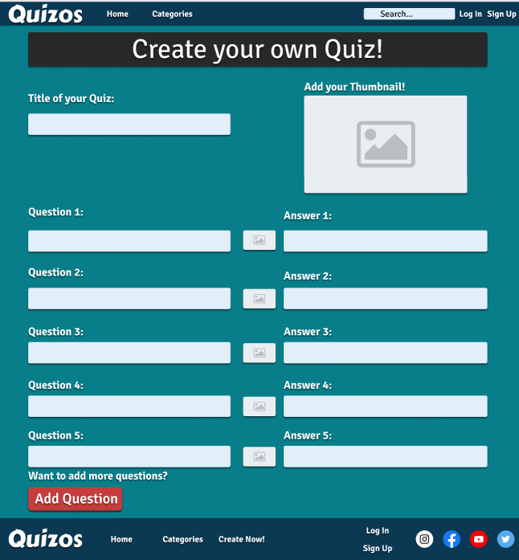

# Quizos
Quizos is a community-based web application for those looking for free entertainment, where users can partake in the various quizzes the site has to offer and maybe learn a thing or two!

Heavily Inspired by Quizlet and Quizizz who the developer believes are great sites for both entertainment and educational purposes. 

The sleek and quick to navigate design allows the user to go from quiz to quiz with minimum effort and easy to find specific quizzes the user may be looking for.

# Table of Contents
1. [UX](#UX)
    1. [Project Goals](#Project-Goals)
    2. [User Stories](#User-Stories)
    3. [Development Planes](#Development-Planes)
3. [Features](#Features)
    1. [Design Features](#Design-Features)
    2. [Features to Implement in the Future](#Features-to-Implement-in-the-Future)
4. [Issues and Bugs](#Issues-and-Bugs)
5. [Technologies Used](#Technologies-Used)
    1. [Languages](#Languages)
    2. [Tools](#Tools)
    3. [Libraries](#Libraries)
6. [Testing](#Testing) ----> [Testing File](TESTING.md)
7. [Deployment](#Deployment)
    2. [Local Copy Creation](#Local-Copy-Creation)
8. [Credits](Credits)
9. [Acknowledgements](#Acknowledgements)

# UX
## Project Goals
The Primary goal for Quizos was to provide a web-based aplication with an easy to navigate and easy to use design that was interactive to the user while utilizing the JavaScript Language to achieve this.

This is the Second of Four Mile Stone Projects the developer must complete during their Full Stack Development Program provided by The Code Institute.

The main requirements for the project were to build an Interactive Frontend web-application with interactive functionalities utilizing HTML5, CSS, and JavaScript.

## User Goals 
The user is looking for:
* Interactive Functionalities that compliment the theme and purpose of the website.

* Entertaining Quizzes with a grading system to check their knowledge on a certain topic. 

* An intuitive and aesthetically pleasing design.

## Developer Goals 
The Developer is looking to:
* Create an interactive quiz website for people looking to test their knowledge on a certain topic or just for a quick dose of entertainment.

* Demostrate their skill and knowledge of the usage of JavaScript.

* Deploy a project they are hapy and satisfied with.

# User Stories
As a General User, I want to :
* Be able to easy access quizzes.

* Be able to know what questions I got wrong and what my overall score for the quiz is.

* Test my knowledge on a variety of topics.

# Development Planes 
In order to design and create a good web-based application , the developer distinguished the required functionality of the site and how it would answer the users stories and demands. 

To accomplish this the developer went through a Development process:

## 1. Strategy 
They way the developer approached the design of this project was by addressing and ackowledging  the target audience:
* Demographic: 
    * Students Looking for a study tool
    * People bored and just looking for entertainment
    * Fans of specific genres looking to test their knowledge

The website needs to enable the user to:
* Take the quizzes without any problems

* Display whether they got the right or wrong answer and show which one question they got right or wrong.

* Display the final results of the quiz

## 2. Scope
A scope is utilized to identify what steps need to be taken in order to align the features with the strategy previously defined:

* Content Requirements
    * Variety of Subjects
        * Math
        * Science
        * Computers
        * Social Studies 
        * Languages
        * History
        * Movies 
        * Anime 
        * Sports
        * TV Shows 
        * Music 
        * Art
* Functionality Requirements
    * Quizes 
        * Quizes display the correct question
        * Quizes display 4 possible answer options 
        * Quizes display the correct answer
        * Quizes display the wrong answers
        * Quizes Display the total grade (0-100%)

# 3. Structure
The architecture of the webiste was design to ensure the user can navigate through the quizes and categories in a flawless and quick manner. 

The website is divided in 4 main sections:
1. The Home Page
    * Has some quick access links to some categories
2. Categories Section
    * Display all the available categories
3. The Category
    * Displays the available quizes
4. Quizes
    * Displays the questions and answer options

With the exception of the create page which is separate from the flow of the website since it isn't a currently integrated feature.
1. Create Page
    * Implemented in the future for users to create their own quizes.

# 4. Skeleton
Wireframe mockups were made in [Figma](https://www.figma.com/) to have a visual guide and ensure to provide a good user experience and a satisfying aesthetic.

The Home Page

The Categories Page

The Quiz page

The Create Page

## Design Changes: 
While the developer relied heavily on the wireframes designs in ordered to stay true to the original style and aesthetic of the website some changes were implemented to ensure the best user experience. 

* One of the biggest changes made was to the categories page where a scrolling header was added.

* The create theory was slightly altered The questions no longer have numbers as they will be randomly displayed rather than in a specific order and images will no longer be displayed inside the questions so the ability to add pictures to every question was removed.

* The Login and Sign in were changed from separate pages to small popups. 

# 5. Surface

* Color Scheme 
    * The colors scheme chosen was selected in order to give the webapp a relaxed and layed back aesthetic.

* Typograhpy 
    * The Primary font for this project is [Signika Negative](https://fonts.google.com/specimen/Signika+Negative?query=signika+ne).
    
    * The Font used for logo is [Carter One](https://fonts.google.com/specimen/Carter+One?query=carter+one)

# 6. Features 
## Design Features
Each page of the website contains  a sleek and responsive navigation system:
* The Navbar contains links to all the main pages so that users have quick access to all of the important pages they will want to explore.
    * On Mobile the navbar transforms into a mobile friendly "hamburger" menu 

* The Footer just like the header contains contains all the necessary links aswell as some social links.
 
* The Home Page contains links to some of the available categories to get the user starter. It also contains a brief description about the create page as well as a link to the page itself.

* The Categories page contains links to all the categories available in the website aswell as an automatic scroll banner. 

* The Sub Categories page contains links to the actual quizes as well as a create button linked to the create page. 

* The Quizes consist of 10 questions each with 4 different to choose from.

## Features to Implement in the Future 

# Credits 
## Content 
* The project is heavily inspired by [Quizlet](https://quizlet.com/).

* The quiz content was taken from [Quizizz](https://quizizz.com/join).

## Media 
* All of my images were taken from [Google Images](https://www.google.com/imghp?hl=EN) and so I don't really know where the actual sources of the different images are from.

# Acknowledgements 

* Thanks to my friends and family for helping with some of the ideas and design decisions when I was too indecisive or didn't know what to add into the website.

* Thanks to my mentor Seun Owonikoko for encouraging me to challenge myself to do the quiz website and for some design decisions and critizism. 

* Thanks to the Slack Community for answering questions and clearing my doubts.

* Last but not least Thanks to [Web Dev Simplified](https://www.youtube.com/channel/UCFbNIlppjAuEX4znoulh0Cw) for making great guides and tutorials that made making the quiz a much easier and not so daunting task.