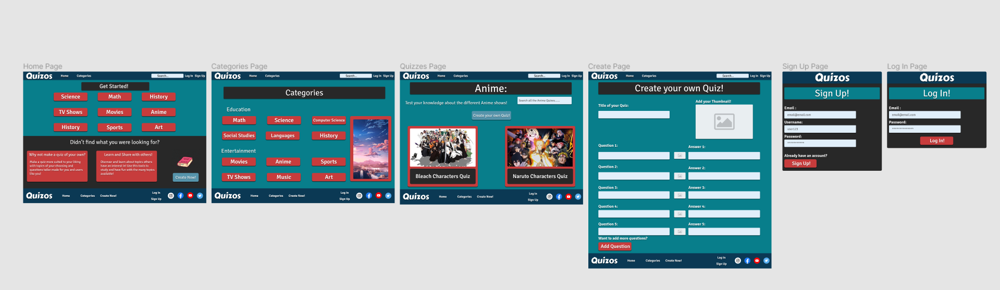

# Quizos
Quizos is a quiz website that offers a wide range of topics to test your knowledge aswell as learn about different subjects. It was an idea that draws a lot of inspiration from Quizlet which is a flashcard website made and used as a tool for students to study. We draw inspiration from the idea that it can be used as a tool for studying but more than that we also wanted to include fun trivia like quizes with a range of topics from sports to tv shows where users can have fun and not just use it as a studying tool.

The decision for making Quizos for my Mile Stone Project 2 was after making a math quiz shortly after learning Java Script the idea just sparked in my mind after thinking of potential project ideas. It would be a good way to test my knowledge and really challenge myself with something I had no idea of where to even start.

# Project Aim 
## User Goals

* To provide users both a helpful tool to study and as a form of entertainment, aswell as a way for them to show their appreciation and dedication towards a certain subject matter be it academic or as a form of entertainment.

* To give users the freedom to create their own quizes reflecting their needs and desires, and to have a wide enough variety of subjects so that it benefits as many people as possible.

* To make an appeling, easy to use website so that anyone can make use of it.

# User Feedback 

1. I had a Computer Science test and was having a hard time learning and memorizing all the information, that's when I stubled upon this website and saw the Networks quiz and even tho it was short it certainly made a difference it helped me study and made studying fun!

2. I found this website while I was bored waiting for my mom to pick me up form school. I ended up doing all of the quizes and the 2018 Hits quiz really brought back memories of summer with my friends. I also told my friends about this website and we started competing amongst each other to see who could get the highest score in the WW1 quiz since we didn't know much about it.

3. I wasn't feeling very confident about my upcoming French quiz but then I found a way to practice and test myself and it made all the difference the repetition and the fact that it tells you the score at the end really encouranged me to keep on practicing since I slowly saw my score going up!

# Design Process 

*  The structure of the page is very simple. There are 3 main pages: Home, Categories, and the Create page these all function as the foundation to the rest of the page. 

* The first step was to get my ideas into paper and so I made a wireframe on [Figma](figma.com) where I was able to project my ideas into a rough draft for what would become the website. The hardest part was choosing a color scheme for the Website. After much trial and error I decided to go with a Blue-ish tone for the page since I didn't want it to look too serious but rather go for that fun and welcoming aesthetic. 

* The Header and Footer are made with a Navy Blue (#0B3954) to add some depth into the page with the font and titles made white to contrast with the deep blue. The main background (#087E8B) is a Teal like color which compliments the Dark Navy Blue of the header and giving the page some life and vibrance. Much of the buttons use a Salmon-like color (#C73C3C) which I found suited heavely and stood out amongst the Blue of the page. The headings and even some secondary backgrounds use a Dark Brown (#282828) to heavily contrast the Teal and give the page some character. Finnally the create button uses a Light Blue (#5694AB) color to encourage users to click on it but we also wanted to differentiate it from the other buttons so that users relate the light blue color to the create button. 

# Wireframing 
[Rough Draft](https://www.figma.com/file/yQKvu4Xj3axGEHCf323MP7/Quizos?node-id=1%3A2) and guideline.

# Features

* Users have 3 main pages to explore: Home, Categories, Create. Home and Categories branch out into the different categories where users will be able to acess the quizzes.

* Due to database limitations the sign up, log in, and create pages serve no purpose since there was no place to store the user data and manipulate it to create new quizzes which would've been added into their user-pages aswell as the fitting category in the main page.

## Home Page

* The Home Page consists of 9 of the 12 topics for users to get started right away.

* The second half of the page consists of a small introduction into the Create page.

## Categories

* The Category page houses all of the different categories with a subheading indicating what the relation between the topics divided into Education and Entertainment.

* I decided to add an image slider on top of each of the respective categories with images relating to each of the categories. The images are on a timer so they will slide automatically to display and represent all of the categories.

### Different Categories

* Inside each of the categories there is two quizzes so that the user can start experiencing the different quizzes. 

* Each quiz is related to the category but they differ in topics to give the user variety.

### Quiz Page

* The quiz page houses the actual quiz with a base question relating to the topic and normally 4 options from where to choose from. Depending on the choice the user can either get the question right or wrong.

* On top of the question there is a display that shows the number of question left and what question the user is on.

* At the end of the quiz the user can see what score they got as well as the option to restart the quiz.

## Create Page

* The Create Page is the template for custom user questions, this is where the users would've been able to make their own questions. 

* With 5 minimum questions to choose from as a base the user gets the option to add extra questions if they so choose to.

* They also get the option to upload an image that will be used as a thumbnail image that will display inside the respective category.

# Technologies Used

### HTML 5
* The language used to create the base structure and content of the website

### CSS
* The language and used to style and add life and character to the website.

### Java Script
* The language used for to make the quiz and a lot of the more complex features

### Bootstrap
* The foundation used to create and form a lot of the website's structure.

### Figma 
* Used to create the rough draft and put my ideas into reality

### Font Awesome
* Used to add the beautiful icons used throughout the site.

### Google Fonts
* Used to give the writing life and help achieve the image of the site.

### Youtube
* A great guide and helping tool for the times I got stuck or just didn't know where or how to start with the ideas I had.

### W3C Schools
* A quick reminder and refresh on some of the basics that I might need clarification on.

### Stack Overflow
* Whenever I got stuck with a problem I didn't know how to even begin to solve I went here and most of the time found the idea to solve the problem not always a direct solution.

# Testing

* How the flow of the site was and how easy it was to acess the many pages and different quizes.

* If people could find what they were looking for with relative ease and without much trouble.

## Validating Code 
* Whenever I stumbled into problems I used these websites to see where the problem was as well as just to make sure I was doing a proper job. 

* [HTML](https://validator.w3.org/)
* [CSS](https://jigsaw.w3.org/css-validator/) 
* [JavaScript](https://beautifytools.com/javascript-validator.php) 

